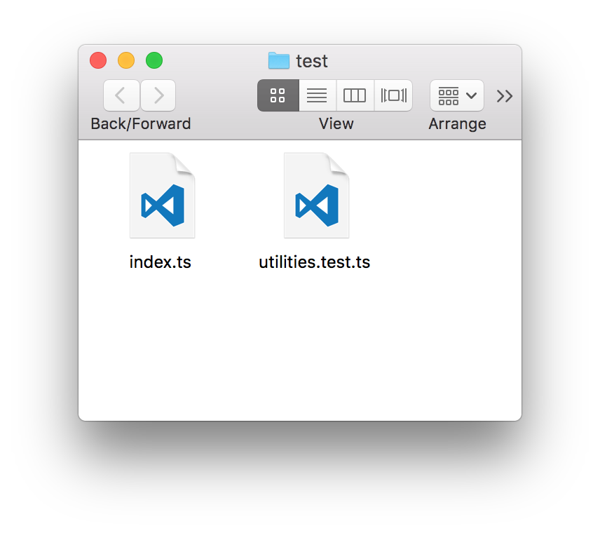

# Show File in File Explorer Extension

This extension is used to open the current place of the opened file in file explorer.

## Features

Open current opened file in file explorer.

With the extension the filepath will be displayed on the statusbar.

When you clock on this path the folder containing the displayed file will be opened.

## Requirements

Currently only works on Mac.